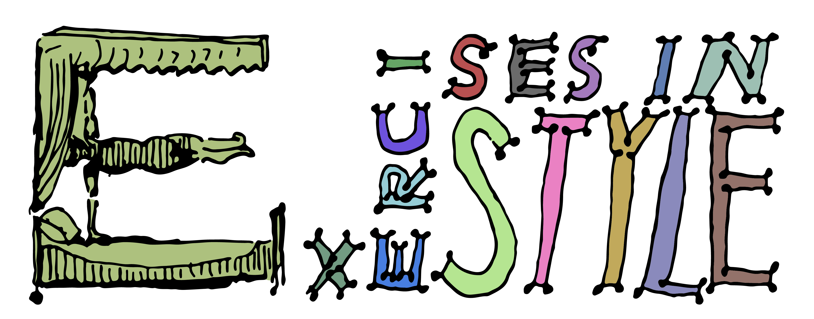

# Hello, Queneau?

Stefan Themerson's cover for the 1958 edition of Raymond Queneau's "Exercises in Style", vectorized and colorized by Wouter Haverals.

**Note:** This notebook is a work in progress and serves as a first viable proof of concept. There might be bugs! 🐞

Hello, Queneau? Welcome to this exploration of literary style and the capabilities of large language models (LLMs) in understanding and recognizing it. Much of the existing literature on style transfer in AI focuses on the technical capabilities of these models. However, a critical aspect often overlooked is how well a language model truly "understands" literary style. Can it discern and interpret stylistic nuances? Answering these questions could provide insights into the abilities of AI, particularly in tasks related to the recognition and classification of literary styles.